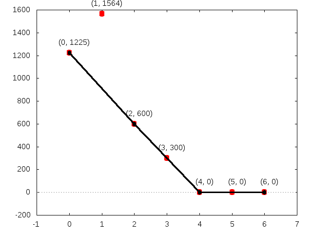

Place the input files in the _input_ folder, refer to _input/README.md_ for file format

## `./step1and2.py`
This generates the elements inside the cones, to be processed by gfan later in `step3.sh`

* **Input:**  `input/cones`, `input/rays` and `input/reduced_grobner_base`
* **Output:** `output/elements.txt`, `output/elements/x-y-z.step2` (being _x,y,z_ the rays of the cone)

_elements.txt_ contains a list of the generated elements, and the generator cone, with the following format (one per line):
`(a,b,c,d) #(x,y,z)` being _x,y,z_ the rays of the cone, and _a,b,c,d,..._ the coordinates of the element.

_x-y-z.step2_ has __gfan__ format

## `./step3.sh`
This proceses the elements generated in the previous step, and generates initial ideals for those elements using `gfan_initialforms --ideal`.

* **Input:**  _output/elements/x-y-z.step2_
* **Output:** _output/initial_ideals/x-y-z.step3_

As this is a slow process, elements that have been already processed and succeeded are not processed again (the input file is copied to _output/success/_).
The time limit for each calculation is 20 minutes, if this is exceeded, the input files is copied into _output/failure/_ and the execution for this particular file stops.

## `./step4.sh`
This converts the gfan output (an initial idea) from previous step (_x-y-z.step3_) into Singular format (the original file is left intact. And then finds the generators for that initial ideal with `step4.singular`

* **Input:**  _output/initial_ideals/x-y-z.step3_
* **Output:** _output/iigen/x-y-z.step4_

## `./newtondiagrams.py`
Prints the Categorization (1, 2 or 3) for the elements obtained in the beginning, the lower hull, the element and the cone.

`./newtondiagrams.py --plot` (argument is optional)  will output the _output/diagrams/x-y-z.png_ file for each element, generated using `gnuplot < plot.gnuplot`.

  

* **Input:**  _output/elements.txt_
* **Output:** _stdout_ (console), _output/diagrams/x-y-z.png_ (if `--plot` is used)

This is reads the _element.txt_ file and outputs (to console) the following information about each element (separated by tabs)
* Type
    * 1, 2 or 3
    * See: [Arithmetics and combinatorics of tropical Severi varieties of univariate polynomials](http://arxiv.org/abs/1601.05479)
* Hidden Ties
    * Relevant when type is 3, in any other case this is `[]`
    * Example: `[(4, 5)]`
* Side lengths of the lower hull with more tan three points
    * Example: `[3, 3]`
* Lower Hull:
    * List of the x coordinates for forming the hull sides.
    * Example: `[[0, 2], [2, 3, 4], [4, 5, 6]]`
* Points (from the element, enumerated):
    * The coordinates of the points for that newton diagram.
    * Example `[(0, 1225), (1, 1564), (2, 600), (3, 300), (4, 0), (5, 0), (6, 0)]`
* Rays (the cone)
    * The indexes of the rays generating the cone for this element.
    * Example: `[3, 12, 13]`

Example line:
`1	[]	[3, 3]	[[0, 2], [2, 3, 4], [4, 5, 6]]	[(0, 1225), (1, 1564), (2, 600), (3, 300), (4, 0), (5, 0), (6, 0)]	[3, 12, 13]`

Example output _3-12-13.png_:

